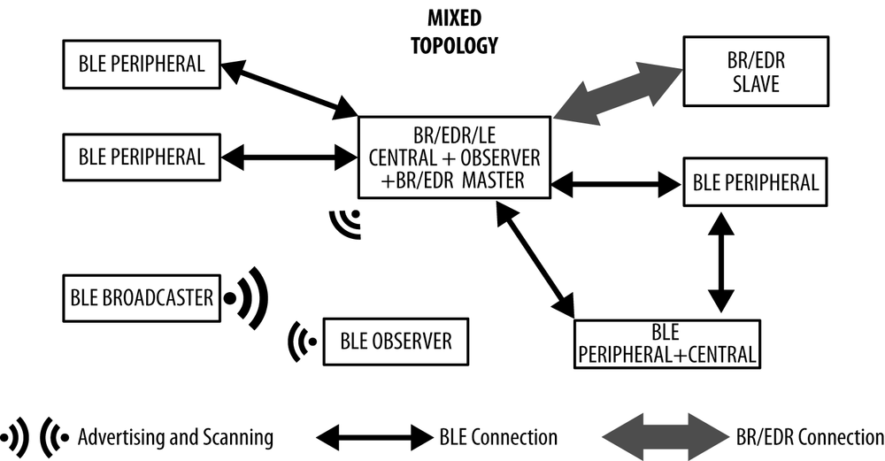

1. The current code works well for a single connection at any given time. For more than one connection at a given time, the various connections are currently not encapsulated from each other and thus contain shared data which is undesirable. Untested.

Test scenario: Connect via app therefore device advertising stops, app thus saves connection information. Disconnect. A second central devce connects then the former also connects.

